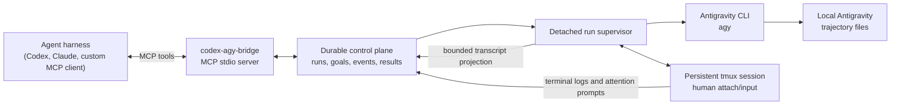

# codex-agy-bridge

[](https://github.com/varadfromeast/codex-agy-bridge/actions/workflows/ci.yml)
[](LICENSE)

Run Antigravity from an agent harness as durable, parallel, human-operable
`agy` sessions over MCP.

<!-- mcp-name: io.github.varadfromeast/codex-agy-bridge -->

`codex-agy-bridge` wraps the official Antigravity CLI with a resumable MCP
control plane. Agent harnesses like Codex, Claude Desktop, or your own
GPT/Claude-powered MCP client can start `agy` runs, wait on sparse events,
attach a real terminal, send guarded input, cancel safely, continue exact
conversations, and collect final results later by `run_id`.

## Quick Install

Prerequisites:

- Codex CLI for the command below, or another local stdio MCP-capable harness
- The official Antigravity CLI (`agy`), already authenticated locally
- `uv` / `uvx`
- `tmux` on macOS:

```bash
brew install tmux
```

Check the required commands:

```bash
codex --version
agy --version
agy models
uvx --version
tmux -V
```

### Day 0 Authentication

`agy --version` only proves the binary exists. Before adding the MCP server,
run `agy models`; if Antigravity asks you to sign in or reports that you are
not logged in, start a visible session and complete the browser/login flow:

```bash
agy --prompt-interactive "Authenticate Antigravity and then exit."
agy models
```

After `agy models` succeeds, install or restart the MCP server. If a bridge run
still hits auth, `agy_run_start` returns `status="auth_required"` and opens a
visible `agy` authentication session by default. Complete sign-in there, then
start a fresh run. You can also use `agy_run_observe(view="terminal")` or
`agy_admin(action="doctor")` to inspect the auth-required status.

Install from PyPI with the Codex CLI:

```bash
codex mcp add codex-agy-bridge \
  --env AGY_CMD="$(command -v agy)" \
  -- "$(command -v uvx)" codex-agy-bridge@latest
```

Restart the harness, then verify in Codex if you used the command above:

```bash
codex mcp get codex-agy-bridge
codex mcp list
```

Remove it with:

```bash
codex mcp remove codex-agy-bridge
```

For Claude Desktop or a custom MCP client, use the same stdio command shape:
`uvx codex-agy-bridge@latest` with `AGY_CMD` set to the authenticated `agy`
executable.

## What Makes It Different

- **Parallel Antigravity sessions:** launch multiple independent `agy` runs,
  each with its own durable state, logs, transcript projection, and result.
- **Human-operable terminals:** foreground runs live in persistent `tmux`
  sessions, so Terminal.app can attach without killing the agent.
- **Resumable MCP control:** MCP calls can time out, the harness can restart,
  and the run can still be observed later by `run_id`.
- **Goal orchestration:** create a goal, start named targets with bounded
  parallelism, and inspect the whole batch as one coordinated effort.
- **Sparse wake events:** `agy_run_wait` short-polls lifecycle, attention,
  progress, and terminal events without transcript-polling spam.
- **Guarded input:** `agy_run_input` can reject stale writes when event or
  transcript cursors changed after the caller observed the run.
- **Trajectory-aware observability:** bounded transcript summaries and terminal
  evidence are exposed without private model reasoning.
- **Operational hygiene:** duplicate active starts are deduplicated, process
  groups are cancelled safely, and completed result artifacts are preserved.

## Install Details

### If You Are An Agent Reading This

Help the user install it; do not silently mutate their machine.

1. Verify prerequisites first:

```bash
command -v codex
command -v agy
command -v uvx
command -v tmux
agy --version
agy models
```

2. If anything is missing, ask before installing it.
3. If `agy models` reports an auth error, help the user complete the Day 0
   authentication flow above before adding the MCP server.
4. Then run:

```bash
codex mcp add codex-agy-bridge \
  --env AGY_CMD="$(command -v agy)" \
  -- "$(command -v uvx)" codex-agy-bridge@latest
```

5. Verify:

```bash
codex mcp get codex-agy-bridge
codex mcp list
```

6. Tell the user to restart their agent harness so the new MCP tools load.

### PyPI

The Quick Install command stores an stdio MCP server definition. When the agent
harness starts the server, `uvx` resolves `codex-agy-bridge@latest` from PyPI,
installs it into an isolated cached environment, and runs the
`codex-agy-bridge` console script. `AGY_CMD` pins the bridge to the user's
already-installed and authenticated `agy` executable.

Do not replace `$` or `$(...)` manually in the command. In POSIX shells,
`$(command -v agy)` and `$(command -v uvx)` expand to absolute executable
paths.

### GitHub

Use this when you want the repository version directly:

```bash
codex mcp add codex-agy-bridge \
  --env AGY_CMD="$(command -v agy)" \
  -- uvx --from git+https://github.com/varadfromeast/codex-agy-bridge \
  codex-agy-bridge
```

### Local Development

```bash
git clone https://github.com/varadfromeast/codex-agy-bridge.git
cd codex-agy-bridge
uv sync --extra dev

codex mcp add codex-agy-bridge \
  --env AGY_CMD="$(command -v agy)" \
  -- uv --directory "$PWD" run codex-agy-bridge
```

## How It Works



The bridge keeps the MCP server responsive while detached supervisors own the
long-running `agy` processes. State and events are persisted locally, so a run
can continue after the original MCP call returns. For the deeper process model,
see [docs/ARCHITECTURE.md](docs/ARCHITECTURE.md). For the MCP control-loop
vision, see [docs/MCP_VISION.md](docs/MCP_VISION.md).

## MCP Tools

| Tool | Purpose |
| --- | --- |
| `agy_run_start` | Start, continue, or open an interactive foreground run |
| `agy_run_wait` | Short-poll until selected runs emit sparse wake events |
| `agy_run_observe` | Read full, status, transcript, or raw terminal views |
| `agy_run_input` | Send input with optional event/transcript preconditions |
| `agy_run_cancel` | Cancel one active run |
| `agy_run_result` | Read final result metadata or bounded result chunks |
| `agy_goal` | Create goals, start targets, and read aggregate status |
| `agy_admin` | Read diagnostics, models, plugins, validation, and changelog |

Typical flow:

```text
agy_run_start -> agy_run_wait -> agy_run_observe -> agy_run_result
```

In Codex MCP, tools may be exposed with the server prefix, for example
`codex_agy_bridge_agy_run_wait`. Run responses include exact `wait_call`
arguments; note that `agy_run_wait` always takes `run_ids: ["..."]`, even for a
single run. Supported wait conditions are `any_attention`, `any_terminal`,
`all_terminal`, `any_event`, and aliases `attention`, `terminal`, `finished`,
`finish`, `complete`, `completed`, `result`, `all_finished`, `all_complete`, and
`all_completed`.

Use `agy_goal` when the harness should split work into named targets with a
shared objective and bounded parallelism.

## Configuration

| Variable | Default | Purpose |
| --- | --- | --- |
| `AGY_CMD` | `agy` on `PATH` | Exact Antigravity executable |
| `AGY_BRIDGE_STATE_DIR` | `~/.local/state/codex-agy-bridge` | Durable run and goal state |
| `AGY_BRIDGE_AGY_ROOT` | `~/.gemini/antigravity-cli` | Antigravity conversations and trajectories |
| `AGY_BRIDGE_MAX_PARALLEL` | `50` | Global concurrent-run limit |
| `AGY_BRIDGE_COMPLETION_STABILITY_SECONDS` | `150` | Time a final marker must remain stable |
| `AGY_BRIDGE_MCP_WAIT_SLICE_SECONDS` | `120` | Max seconds a single `agy_run_wait` MCP call blocks before returning a snapshot so gateways do not time out |

Run state survives MCP server restarts under
`~/.local/state/codex-agy-bridge/`.

## Status And Risk

This project is experimental. It currently targets Python 3.11+, macOS,
`tmux`, and Antigravity CLI 1.0.8-compatible commands and trajectory files.

Antigravity is an agentic CLI. It can read and write files, execute commands,
and access the network with the current user's privileges. This bridge is not a
sandbox or security boundary.

The bridge always enables Antigravity's dangerous permission-skip policy so
unattended runs do not stall on CLI approval prompts. Any
`dangerously_skip_permissions=false` input is rejected; the only allowed value
is `true`. `sandbox=true` and `additional_directories` are CLI policy hints,
not filesystem containment.

The bridge does not read or copy Antigravity OAuth credentials. It invokes the
installed `agy` binary and reads ordinary local conversation metadata and
trajectory files.

## Development

```bash
git clone https://github.com/varadfromeast/codex-agy-bridge.git
cd codex-agy-bridge
uv sync --extra dev
uv run pytest
uv run ruff check .
uv build
```

Run the server directly:

```bash
uv run codex-agy-bridge
```

The server uses stdio transport. Do not print diagnostic text to stdout; it
would corrupt MCP framing.

## Publishing

A pushed version tag runs `.github/workflows/publish.yml`, which verifies
versions, runs checks, builds distributions, publishes to PyPI through GitHub
OIDC, creates a GitHub release, and publishes `server.json` to the MCP
Registry.

## Compatibility

The current reader expects Antigravity trajectory JSONL under:

```text
~/.gemini/antigravity-cli/brain/<conversation-id>/
  .system_generated/logs/transcript.jsonl
```

If Antigravity moves to SQLite or a local daemon API, a new adapter can replace
this reader without changing the MCP tool contract.

## License

[MIT](LICENSE)
