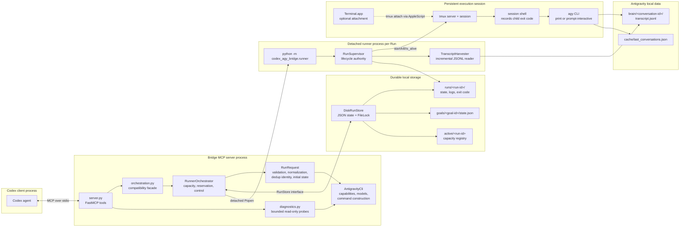
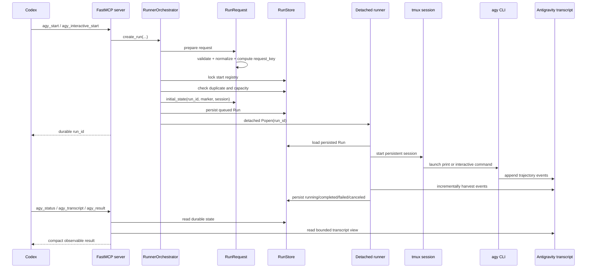
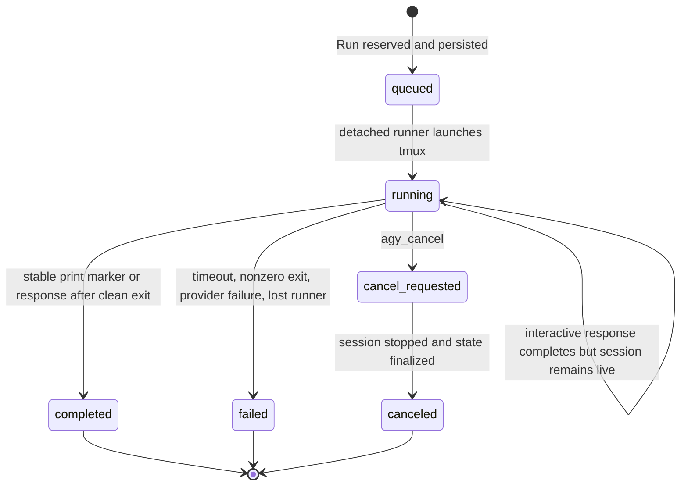

# Product Architecture

## Process Topology

The bridge is a local, process-isolated control plane around the Antigravity
CLI. MCP requests remain short-lived while delegated agent work survives in a
detached Python worker and a persistent tmux session.

## Run Creation And Execution

## The Important Modules

| Module | Interface responsibility | Why it matters |
| --- | --- | --- |
| `server.py` | Stable MCP tool contract | Keeps Codex-facing schemas small and transport-specific behavior out of the product logic. |
| `run_request.py` | Prepare one immutable Run Request | Concentrates validation, execution-policy checks, deduplication identity, and initial persisted-state construction. |
| `_orchestrator.py` | Reserve and control durable Runs and Goals | Owns capacity, deduplication reservation, persistence coordination, cancellation, and detached process startup. |
| `store.py` | Persist and atomically update Run and Goal state | Disk and memory adapters make the same lifecycle interface available to production and tests. |
| `runner.py` | Detached worker entrypoint | Separates long-lived delegated work from MCP tool timeouts and server restarts. |
| `supervision.py` | Authoritative lifecycle for one Run | Observes completion, timeout, cancellation, conversation discovery, and actual child exit status. |
| `execution.py` / `terminal.py` | Execution Session interface and tmux adapter | Keeps process persistence, input delivery, and Terminal.app attachment behind one seam. |
| `cli.py` | Antigravity CLI compatibility | Localizes changing CLI commands, capability probing, model discovery, and bounded subprocess output. |
| `core.py` / `transcript.py` | Antigravity data compatibility and observation | Isolates assumptions about trajectory files and returns bounded, sanitized progress. |

## Lifecycle Authority

The persisted Run state is authoritative. Transcript events are historical
producer output and may still show a running tool call after cancellation.

## Stability And Extensibility

- **MCP timeout isolation:** the MCP server only reserves work and returns a
  `run_id`; detached runner processes own long execution.
- **Server restart survival:** Run and Goal state, logs, active sentinels, and
  tmux sessions are durable outside the MCP process.
- **Concurrency correctness:** a global start lock makes deduplication and
  capacity reservation atomic before spawning.
- **Terminal persistence:** tmux keeps the CLI alive independently of
  Terminal.app and records the actual child exit code.
- **Compatibility locality:** CLI changes belong in `AntigravityCli`;
  trajectory-format changes belong in `core.py` and `TranscriptHarvester`.
- **Testable seams:** `RunStore`, `ProcessManager`, and `ExecutionSession` have
  production and in-memory adapters. The Run Request interface is directly
  testable without spawning processes.
- **Explicit context:** exact conversation IDs continue native context; Goals
  coordinate Runs but do not implicitly merge conversation context.
