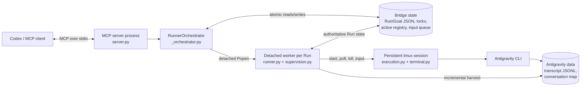
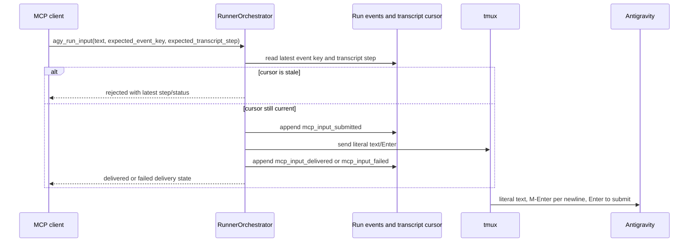
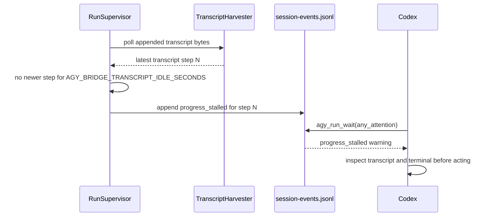

# Architecture: Need to Know

This is the minimum mental model needed to change `codex-agy-bridge` safely.
The bridge is a local control plane: MCP calls return quickly, while durable
worker processes and tmux sessions own long-running Antigravity work.

## The 5 Things You Need to Know

### 1. Runtime Topology



The MCP server does not wait for delegated work. Each Run gets a detached
Python supervisor and a tmux session that outlive MCP connections and
Terminal.app. Persisted Run state is authoritative; transcripts are history.

### 2. Architectural Seams

| Seam | Interface | Production adapter | Test adapter |
| --- | --- | --- | --- |
| State storage | `RunStore` | `DiskRunStore` | `MemoryRunStore` |
| Execution session | `ExecutionSession` | `TmuxSession` | `MockSession` |
| Worker processes | `ProcessManager` | `LocalProcessManager` | Injected fake managers |
| CLI validation | `CliValidator` | `AntigravityCli` | `FakeCli` |

CLI compatibility belongs in `cli.py`, persistence in `store.py`, and tmux
behavior in `execution.py` and `terminal.py`.

### 3. Primary Call Chains

#### Start a Run

```text
MCP client
  -> server.py: agy_run_start()
  -> orchestration.py: create_run()                  facade
  -> _orchestrator.py: RunnerOrchestrator.create_run()
  -> run_request.py: RunRequest.prepare()
       validate input and CLI capabilities
       normalize paths and policy
       compute canonical request_key
  -> RunStore.list_active_runs()                     dedup/capacity
  -> RunStore.save_run()                             persist queued Run
  -> ProcessManager.spawn()                          detached runner

[detached process]
  -> runner.py: main()
  -> supervision.py: RunSupervisor.execute()
  -> execution.py: TmuxSession.start()
  -> terminal.py: launch()
  -> Antigravity CLI
  -> TranscriptHarvester.poll()
  -> RunStore.update_run()                           terminal state
```

The start lock covers deduplication, capacity, and persistence. Process spawn
happens after releasing the lock so slow OS work does not serialize starts.

#### Send Interactive Input



Input is an optimistic write, similar to Kubernetes `resourceVersion` updates:
Codex can pass the event key and transcript step it observed. If the Run has
advanced, the bridge refuses to send keys and returns fresh evidence. This
prevents Codex from answering an old prompt after Antigravity already moved on.

#### Progress-Stall Wakeup



`progress_stalled` is a wake-up hint, not a stuck verdict. Codex should inspect
`agy_run_observe(view="full")` or `view="terminal"` before sending input.

Goals are bridge-owned MCP scheduling records. They coordinate independent
Antigravity Runs; they are not an Antigravity primitive and do not provide
shared native conversation context.

### 4. Files That Matter

| File | Approx. lines | Read it when |
| --- | ---: | --- |
| [`_orchestrator.py`](../src/codex_agy_bridge/_orchestrator.py) | 820 | Changing reservation, capacity, deduplication, Goals, cancellation, status, or input routing |
| [`supervision.py`](../src/codex_agy_bridge/supervision.py) | 254 | Changing Run completion, cancellation, timeout, transcript observation, or queue draining |
| [`server.py`](../src/codex_agy_bridge/server.py) | 323 | Changing MCP schemas or tool contracts |
| [`run_request.py`](../src/codex_agy_bridge/run_request.py) | 222 | Changing validation, normalization, execution policy, or request identity |
| [`store.py`](../src/codex_agy_bridge/store.py) | 264 | Changing atomic Run/Goal persistence |
| [`cli.py`](../src/codex_agy_bridge/cli.py) | 196 | Adapting to Antigravity CLI changes |
| [`terminal.py`](../src/codex_agy_bridge/terminal.py) | 130 | Changing tmux launch, attachment, or literal/multiline input |
| [`interactive_input.py`](../src/codex_agy_bridge/interactive_input.py) | 48 | Changing durable interactive queue semantics |

Glue files: `orchestration.py` is the facade; `runner.py` is the worker
entrypoint; `execution.py` provides session adapters; `core.py` provides paths
and transcript compatibility; `diagnostics.py` contains bounded probes; and
`state.py` defines persisted shapes.

### 5. What Changed Recently

```diff
 Run creation
- validation and request identity spread across orchestration code
+ RunRequest owns validation, normalization, and canonical identity

 Interactive lifetime
- interactive Runs inherited print-mode hard timeouts
+ interactive Runs stay alive until canceled or the session exits

 Interactive input
- MCP calls wrote directly to tmux while Antigravity could still be busy
+ submitted prompts enter a durable per-Run FIFO queue
+ supervisor releases one prompt after each completed response

 Multiline input
- embedded newlines could submit partial prompts or become spaces
+ terminal sends literal line segments with M-Enter, then Enter once

 MCP and diagnostics
- extra fields could be silently ignored; CLI probe failures could cascade
+ tool arguments reject extras; probes are bounded and failure-isolated
```

## Safety Invariants

- Validate before capacity checks, state creation, or process spawn.
- Hold the start lock only for deduplication, capacity, and reservation.
- Never derive terminal Run status solely from late transcript output.
- Persist state before spawning; persisted state must survive MCP reconnects.
- Keep public transcript content bounded and omit private completion markers.
- Reject dead-session input rather than queueing work that cannot be consumed.
- Treat `sandbox` and additional directories as CLI policy hints, never as
  filesystem containment.
- Inspect affected call paths before editing shared symbols and review the
  final diff before committing.
