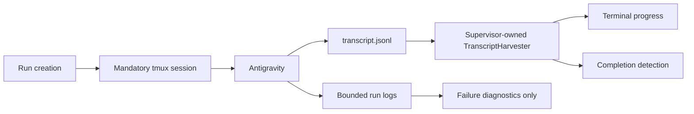

# High-Risk Optimization Plan

This document records the two highest-risk performance optimizations, the
production patterns researched for each problem, and the recommended design for
this codebase.

## 1. Transcript Processing

### Problem

The original implementation repeatedly read and parsed the complete transcript
during supervisor polling. For a transcript growing to `T` records, cumulative
work could approach `O(T^2)`.

The first optimization introduced a global process-local cache containing:

- Byte offsets.
- Pending partial bytes.
- All parsed records.
- Step indexes.
- The latest response.
- Inode and prefix identity.
- A global lock.
- LRU eviction.

This improves performance but introduces substantial shared-state complexity.

### Production Patterns

Production log readers generally use:

- One harvester per file.
- A private `inode/fingerprint + offset` checkpoint.
- Independent offsets when consumers require independent delivery.
- A single reader with fan-out when several consumers need the same records.
- No processing markers written into the producer-owned log.
- No shared file-description cursor when every consumer needs every record.

A shared file description is unsuitable here because it distributes records
between readers rather than broadcasting every record to every consumer.

### Recommended Design

Create a supervisor-owned `TranscriptHarvester`:

```python
class TranscriptHarvester:
    conversation_id: str
    identity: FileIdentity | None
    offset: int
    pending: bytes
    latest_response: str | None
    latest_step_index: int

    def poll(self) -> list[dict[str, Any]]:
        ...
```

One supervisor owns one harvester:

```text
transcript.jsonl
      |
      v
TranscriptHarvester.poll()
      |
      +-- new steps -> terminal progress
      +-- latest response -> completion detection
```

### Implementation Steps

1. Add a new `transcript.py` module.
2. Move incremental JSONL parsing into `TranscriptHarvester`.
3. Handle missing files, partial records, truncation, replacement, and malformed
   complete records.
4. Instantiate the harvester after conversation discovery.
5. Poll it once per supervisor iteration.
6. Pass parsed records directly to terminal-progress rendering.
7. Read `harvester.latest_response` for completion detection.
8. Restore `core.read_steps()` as a simple stateless full reader.
9. Remove the global transcript cache, lock, LRU eviction, complete step lists,
   and bisect index.
10. Keep API transcript reads stateless initially.
11. Benchmark API transcript polling separately before optimizing it.

### Required Tests

- The first poll reads existing records.
- The second poll reads only appended records.
- Partial JSON is completed on the next poll.
- Truncation resets the reader.
- File replacement resets the reader.
- Malformed complete records are ignored.
- Final responses update correctly.
- One poll feeds both progress rendering and completion detection.
- Memory does not grow with total transcript size.
- Existing detached-run and concurrent-append tests pass.

### Success Criteria

- The supervisor parses each transcript byte approximately once.
- There is no global transcript state.
- No cross-process locks are required.
- Memory is bounded by the current batch and partial record.
- Public transcript responses remain unchanged.

### Implementation Status

Completed:

- Added `TranscriptHarvester` with supervisor-local offset, identity, partial
  record, latest-step, and latest-response state.
- Removed the global transcript cache, lock, LRU, retained step history, and
  bisect index.
- Restored stateless public transcript reads.
- Routed one supervisor poll to both terminal progress and completion
  detection.
- Added coverage for initial/appended records, partial JSON, truncation,
  replacement, missing files, malformed records, response tracking, bounded
  memory, detached execution, and concurrent appends.
- Updated tmux session creation to propagate bridge environment variables,
  preventing persistent tmux servers from launching runs with stale
  environment state.

Benchmark on a 10,000-record transcript over 200 no-new-data polls:

```text
stateless full reader: 2.0527s
TranscriptHarvester:   0.0167s
speedup:               122.9x
```

## 2. Provider Health

### Original Problem

Headless starts scanned every historical run directory to infer provider health.

The attempted optimization persisted:

```text
state/provider-health.json
```

This made lookup `O(1)` but created stale-authority problems:

- Old authentication failures could block healthy launches.
- Old success could incorrectly authorize launches.
- Concurrent completion ordering could overwrite newer observations.
- Recovery required TTL and half-open circuit-breaker semantics.

### Production Patterns

Production health caches generally use:

- Expiring observations with a TTL.
- `observed_at` and `expires_at`.
- Ordered updates that reject older observations.
- Open, half-open, and closed circuit-breaker states.
- Active recovery probes.
- Cached health as a hint rather than permanent truth.
- Consecutive observations to avoid state flapping.

### Current Product Decision

Headless execution has been removed.

Every run:

- Uses tmux.
- Opens Terminal.app.
- Allows interactive authentication recovery.
- Continues after the Terminal window is closed.

Provider health is therefore no longer needed as a launch gate.

### Recommended Design

Do not reintroduce the provider-health index.

Keep provider-health classification local to the run that failed:

```python
def run_provider_health(run_directory: Path) -> dict[str, Any]:
    ...
```

Use it only for diagnostics:

```text
run exits without response
      |
      v
inspect bounded recent logs
      |
      +-- authentication interaction required
      +-- response timeout
      +-- rate limited
      +-- quota exhausted
      +-- unknown
```

### Implementation Status

Completed:

- Removed `provider-health.json`.
- Removed provider-health locking.
- Removed historical health scans.
- Removed `AntigravityAuthRequired`.
- Removed headless preflight checks.
- Retained bounded binary log tails.
- Retained per-run failure classification.

### Remaining Work

1. Consider renaming `provider_health()` to clarify its diagnostic scope, such
   as `classify_provider_log()` or `classify_run_failure()`.
2. Consider backward chunk scanning only if the current 100 KB and 20 KB limits
   produce false negatives.

Verified:

- Documentation states provider classification is post-exit diagnostics only.
- A launch test fails if provider classification is invoked before run
  creation.
- Provider log reads remain bounded to 100 KB and 20 KB tails.

### Success Criteria

- Provider-health state cannot become stale because it is not persisted.
- Run creation never depends on historical health.
- Authentication remains recoverable through tmux.
- Failed runs still produce actionable diagnostic messages.
- No global circuit-breaker state machine is required.

## Implementation Sequence

1. Preserve the mandatory tmux changes.
2. Benchmark the current global transcript cache against the old full reader.
3. Add tests for `TranscriptHarvester`.
4. Implement the supervisor-owned harvester.
5. Remove the global transcript cache.
6. Run focused transcript and supervision tests.
7. Run the complete test, lint, and type-check suites.
8. Verify provider health remains diagnostic-only.
9. Run GitNexus `detect_changes()` against `main`.
10. Update the architecture section in `README.md`.

## Target Architecture



This removes both risky global mechanisms:

- No global transcript cache.
- No global provider-health cache.

The remaining optimizations are local, ownership-oriented, and easier to
reason about.
