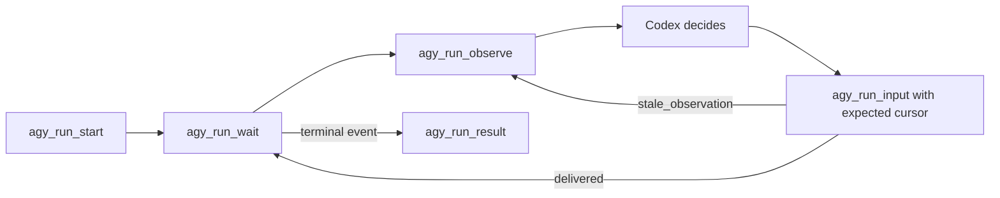

# MCP Vision

The bridge should feel like a small local control plane, not a bag of one-off
tools. Codex starts Runs, waits for sparse events, observes fresh state, and
acts only when its observation is still current.

## Desired Loop

## Principles

- Expose a lean tool surface. Prefer one deep tool with a clear `view` or
  `action` over many narrow tools that teach Codex the wrong workflow.
- Make `agy_run_wait` the low-churn wake primitive. It should return sparse
  lifecycle, attention, terminal, and progress-stalled events.
- Treat `progress_stalled` as a warning. It means "inspect now", not "send yes".
- Make input optimistic. `agy_run_input` should accept the event key and
  transcript step Codex observed, then reject the write if the Run advanced.
- Return fresh evidence on conflict. A stale input rejection should include the
  latest transcript step, latest event key, compact status, and a retry hint.
- Keep raw terminal visibility available. `agy_run_observe(view="terminal")`
  is the direct lane when semantic classifiers miss a live CLI state.
- Keep filesystem state durable and boring: atomic JSON writes for state,
  append-only JSONL for events, tiny cursor files for waits, and bounded log
  tails for diagnostics.

## Exposed Tools

| Tool | Role |
| --- | --- |
| `agy_run_start` | Start, continue, or open an interactive Run |
| `agy_run_wait` | Block on sparse wake events |
| `agy_run_observe` | Read full/status/transcript/terminal views |
| `agy_run_input` | Send guarded input to a live foreground Run |
| `agy_run_cancel` | Cancel one Run |
| `agy_run_result` | Read final result metadata or chunks |
| `agy_goal` | Create goals, start targets, and read goal status |
| `agy_admin` | Diagnostics and CLI metadata |

## Non-Goals

- Do not regex every possible Antigravity prompt shape.
- Do not make Codex poll transcripts continuously.
- Do not send terminal input from stale observations.
- Do not expose sandbox flags as a security boundary; they are CLI policy hints.
